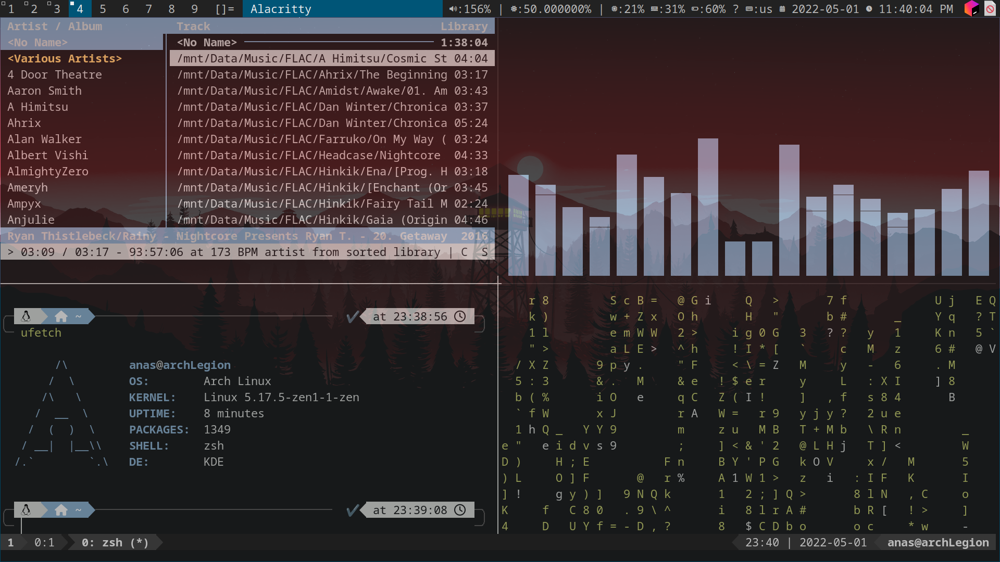
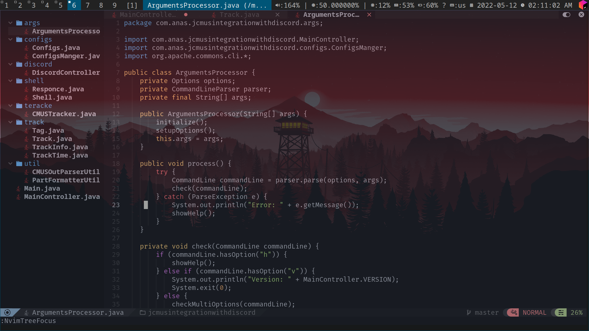

# My configs 😃
### I use arch btw 🥰

```bash

                   -`                    anas@archLegion
                  .o+`                   ---------------
                 `ooo/                   OS: Arch Linux x86_64
                `+oooo:                  Host: 81SX Legion Y540-15IRH
               `+oooooo:                 Kernel: 5.17.5-zen1-1-zen
               -+oooooo+:                Uptime: 20 hours, 20 mins
             `/:-:++oooo+:               Packages: 1349 (pacman)
            `/++++/+++++++:              Shell: zsh 5.8.1
           `/++++++++++++++:             Resolution: 1920x1080 @ 144.00Hz
          `/+++ooooooooooooo/`           DE: Plasma 5.24.4
         ./ooosssso++osssssso+`          WM: dwm
        .oossssso-````/ossssss+`         Theme: [Plasma], Breeze [GTK2/3]
       -osssssso.      :ssssssso.        Icons: [Plasma], breeze [GTK2/3]
      :osssssss/        osssso+++.       Terminal: alacritty
     /ossssssss/        +ssssooo/-       CPU: Intel i7-9750H (12) @ 4.500GHz [53.0°C]
   `/ossssso+/:-        -:/+osssso+-     GPU: NVIDIA GeForce GTX 1660 Ti Mobile
  `+sso+:-`                 `.-/+oso:    Memory: 5995MiB / 15917MiB (37%)
 `++:.                           `-/+/   Battery0: 57% [Unknown]
 .`                                 `/
```

#### Index
- [/etc](./etc)
- [.config](./.config)
- [.zshrc](./.zshrc) my main shell
- [.tmux.conf](./.tmux.conf)


#### Screenshots 


- I use [Nvchad](https://github.com/NvChad/NvChad)

#### Also available on
- [GitLab](https://gitlab.com/Anas-Elgarhy/dotfiles)
- [BitBucket](https://bitbucket.org/anas_elgarhy/dotfiles)
- [Codeberg](https://codeberg.org/anas-elgarhy/dotfiles)
- [Notabug](https://notabug.org/anas-elgarhy/dotfiles) not instant updated
