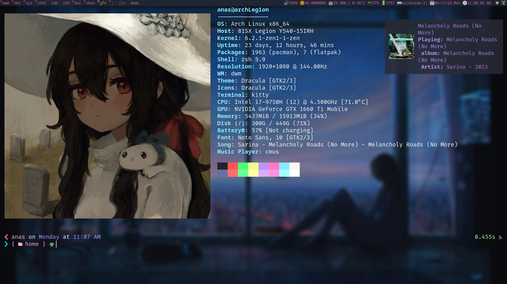
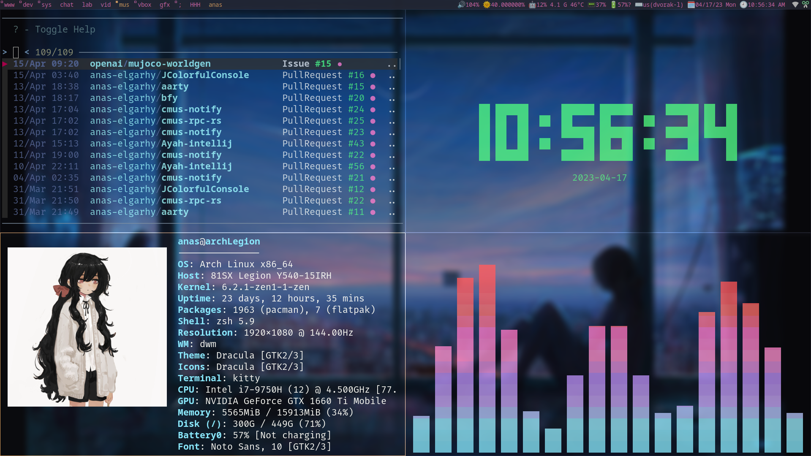
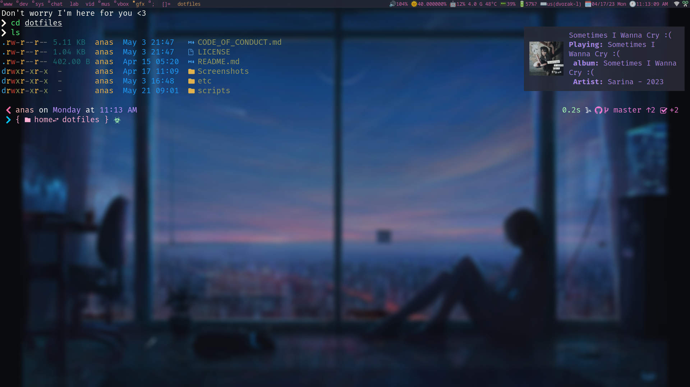

### Screenshots 

### Ref
* If u use a laptop like me and only use [yo-dwm](https://github.com/anas-elgarhy/yo-dwm) or any other standalone WM u may notch that the touchpad doesn't work as you expect (like u can't perform the mouse buttons clicks with it), in this case, you need to configure the touchpad driver(and maybe download the driver itself). In most cases [libinput](https://wiki.archlinux.org/title/Libinput) is more than enough and it's installed by default with Xorg-server and Wayland, but in my case, I go with [synaptics](https://wiki.archlinux.org/title/Touchpad_Synaptics#Natural_scrolling) at least for now 'cause why not?, see [30-touchpad.conf](./etc/X11/xorg.conf.d/30-touchpad.conf)

### Also available on
* [GitLab](https://gitlab.com/Anas-Elgarhy/dotfiles)
* [BitBucket](https://bitbucket.org/anas_elgarhy/dotfiles)
* [Codeberg](https://codeberg.org/anas-elgarhy/dotfiles)
* [Notabug](https://notabug.org/anas-elgarhy/dotfiles) not instant updated
* [disroot](https://git.disroot.org/anas-elgarhy/dotfiles)
